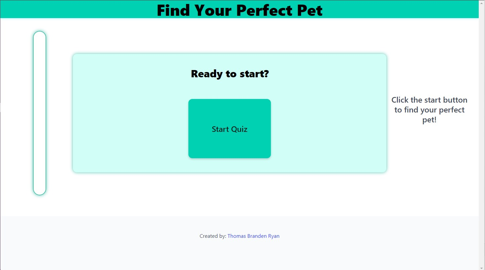
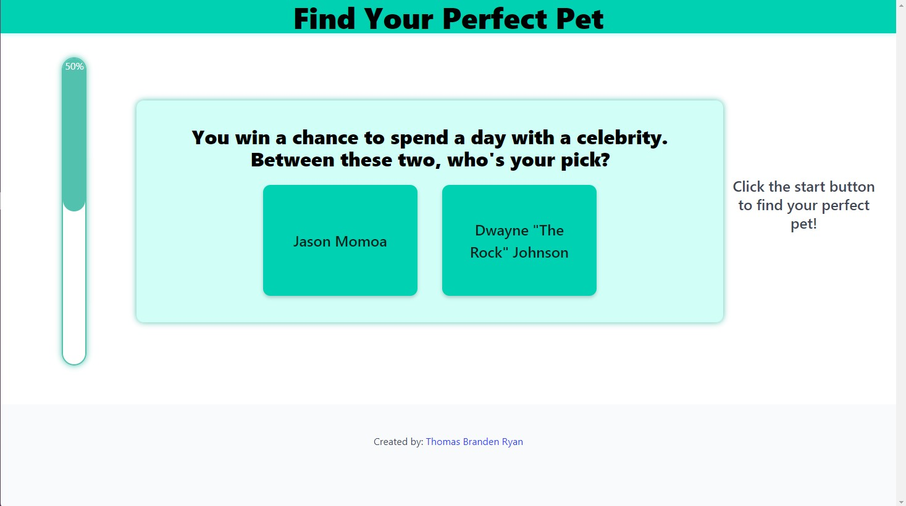
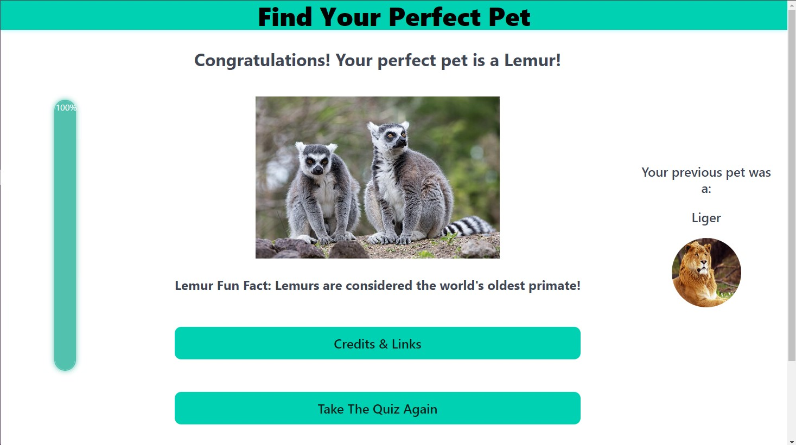

# Pet Finder Quiz

https://tomjp424.github.io/pet-finder-quiz/

## Description

This quiz was created to allow users to answer a series of questions to help them find the type of pet that may be a perfect fit for them. There is a progress bar to help keep track of how far along in the quiz the user is currently. There is also a sidebar that includes the user's previous pet they may have had assigned to them if they took the quiz previously. Once all of the questions are answered, the user is presented with a picture of their perfect pet, along with the name of the animal, and a fun fact about the animal. Finally, there are two buttons after the quiz for the user to click. One is a credit and links button that brings up a modal that includes links to the creators Github accounts as well as links to where all animal images originated. The animal links can also provide users with more information on an animal if they were interested to learn more. The second button is one that can be used to start the quiz over and see what other pets the user may enjoy!

## Usage

Upon initial loading of the page, simply click the start quiz button to get started.

Next, read each question carefully and click on the answer button you feel is the best fit.

When you have finished answering all of the questions you will be presented with your perfect pet! You can click on the credit and links button to learn more about the creators or the animal you were assigned. You can also click the take the quiz again button to start the quiz over.

## Roadmap

Plans for future development on this page include additional questions and answers along with and extended selection of animals that can be assigned. There are also plans to eventually incorporate fade in and out transition animations between questions as answer buttons are selected.

## Authors

- Thomas Phillips (https://github.com/Tomjp424)
- Branden Camilo (https://github.com/CamBC-Lab)
- Ryan Paulette (https://github.com/pauletters)

